# 🌐 Bank Term Deposit Prediction & Deployment

This project focuses on building and deploying a machine learning model using the Bank Marketing Dataset. The main goal is to predict whether a client will subscribe to a term deposit based on various client attributes and campaign-related features.

### 📁 The project involves

Data preprocessing (handling missing values, encoding, scaling, outlier detection)

Applying machine learning models: Support Vector Machine (SVM) and Logistic Regression (LR)

Evaluating the model’s performance and significance of results.

Deploying the final model on AWS with a user-facing form that accepts input fields and predicts the outcome

Designing the solution architecture, deployment diagram, and CI/CD pipeline for production deployment

---

## 💻 Technology Stack

### 🖥️ Frontend
- **HTML** 
- **CSS** 
- **JavaScript** 

---

## 🧰 Backend
- **Language**: Python
- **Framework**: Flask
- **Functionality**: Serves REST API for term deposit subscription prediction
- **Entry Point**: `app.py`

---

## 🧠 Machine Learning
- **scikit-learn** – Machine learning framework
- **joblib** – For serializing and deserializing ML models and preprocessing objects
- **Artifacts**:
  - `log_reg_model.pkl` – Pre-trained Logistic Regression model
  - `scaler.pkl` – Pre-fitted scaler for data normalization

---

## 📦 Containerization
- **Docker** – Used to package the application into a portable container
  - Defined using `Dockerfile`
  - Enables consistent deployment across environments
  - Exposes Flask application through port 80

---

## ☁️ Cloud Infrastructure / CI-CD
- **AWS CodeBuild / CodePipeline** – Automates build and deployment using `buildspec.yaml`
- **Possible Deployment Targets**:
  - AWS ECR (Elastic Container Registry)
  - AWS ECS (Elastic Container Service)
  - AWS Code Pipeline
  - AWS Code Build

---

## 📦 Package & Dependency Management
- **Python Dependencies**: Managed via `requirements.txt`
- **Expected Libraries**:
  - `flask`
  - `scikit-learn`
  - `joblib`
  - `numpy`, `pandas` (if used in preprocessing)

---

## 📁 Project Artifacts Summary

```
.
├── app.py                 # Flask application
├── log_reg_model.pkl      # Pre-trained logistic regression model
├── scaler.pkl             # Pre-fitted scaler for input data
├── requirements.txt       # Python dependencies
├── Dockerfile             # Docker build configuration
├── buildspec.yaml         # AWS build configuration

```

## 🖼️ Project

### Designed Solution Architecture  

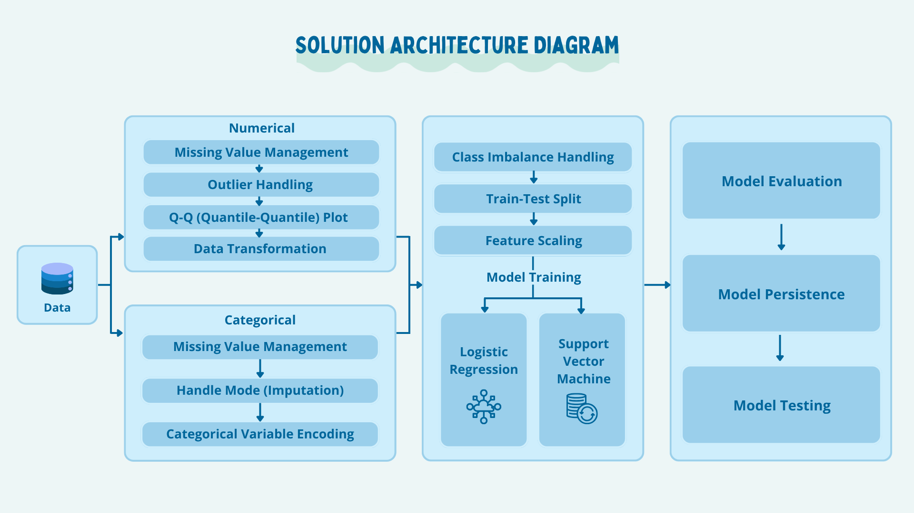

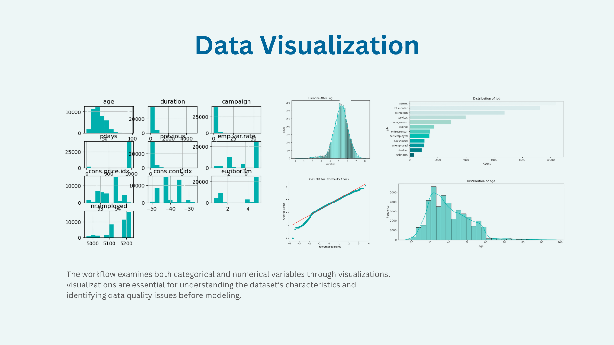

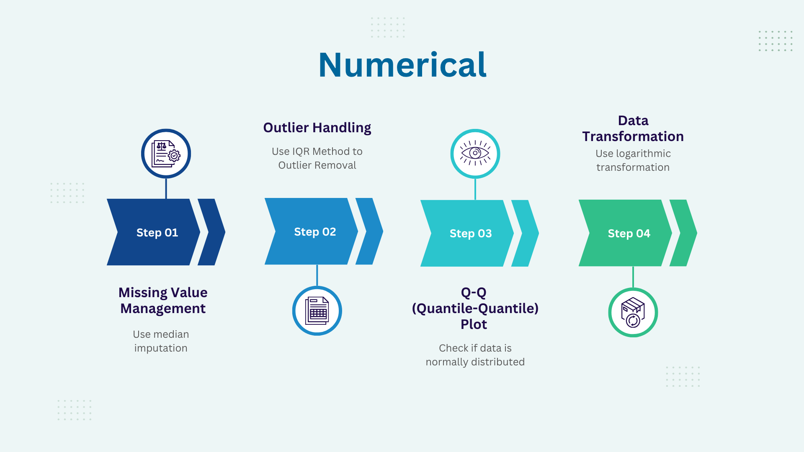

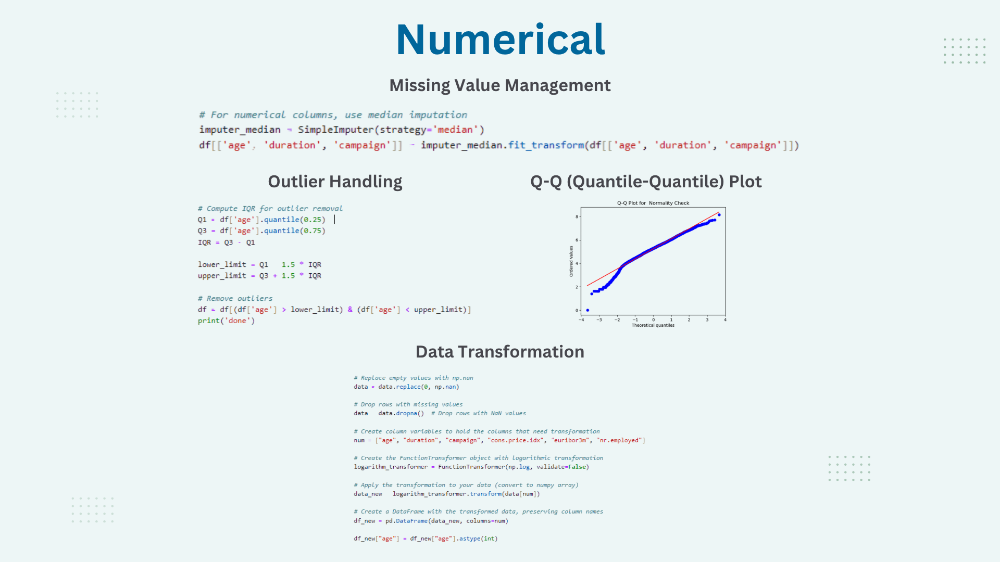

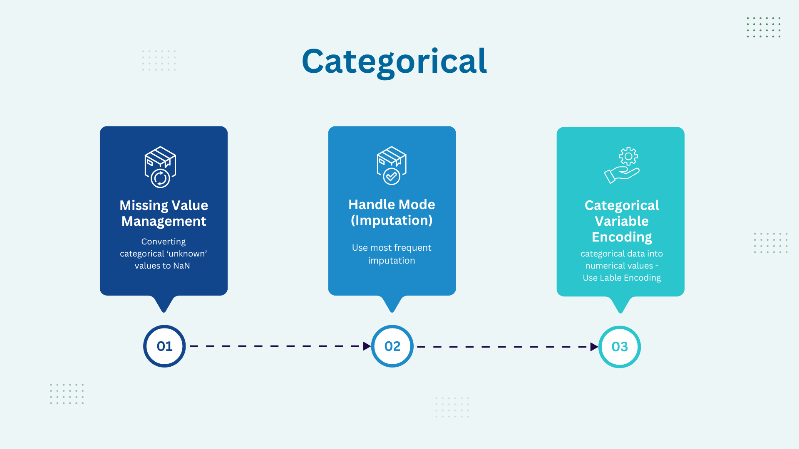

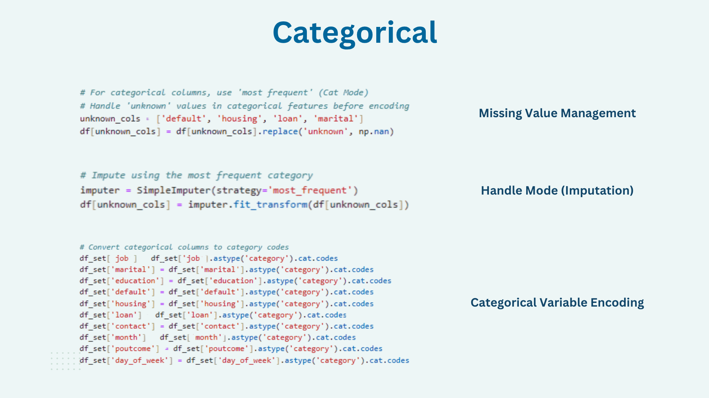

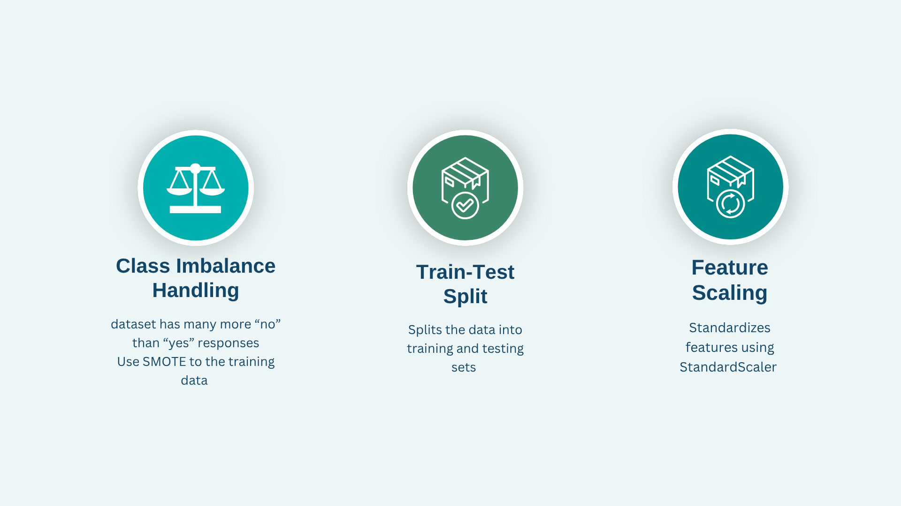

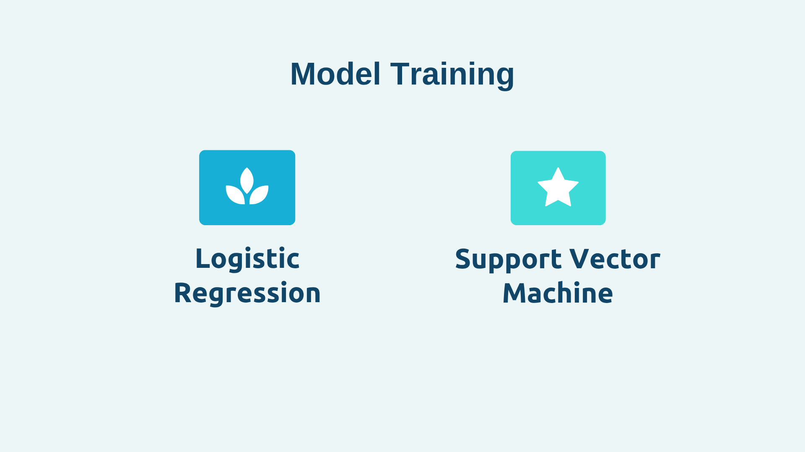

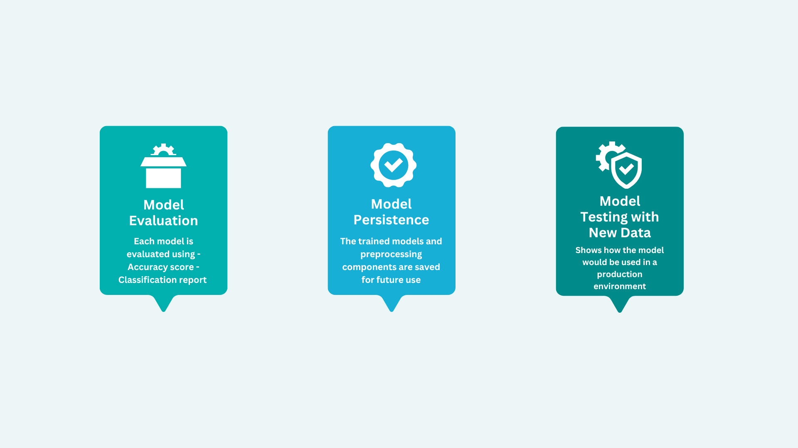

### Deployment Architecture Diagram 

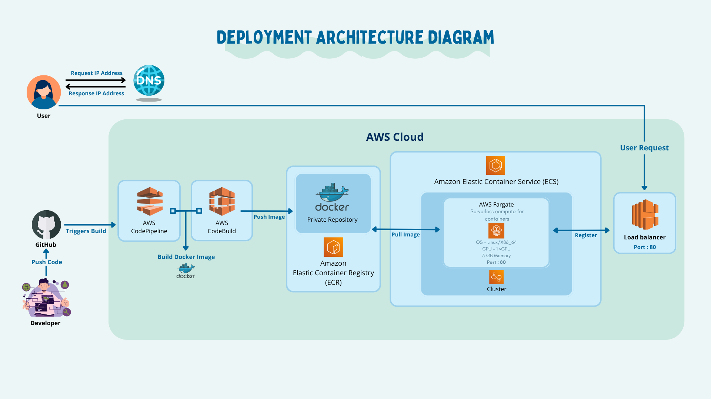

## 🖥️ Frontend

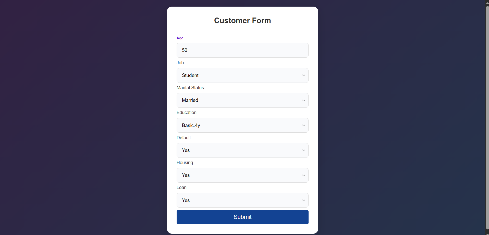

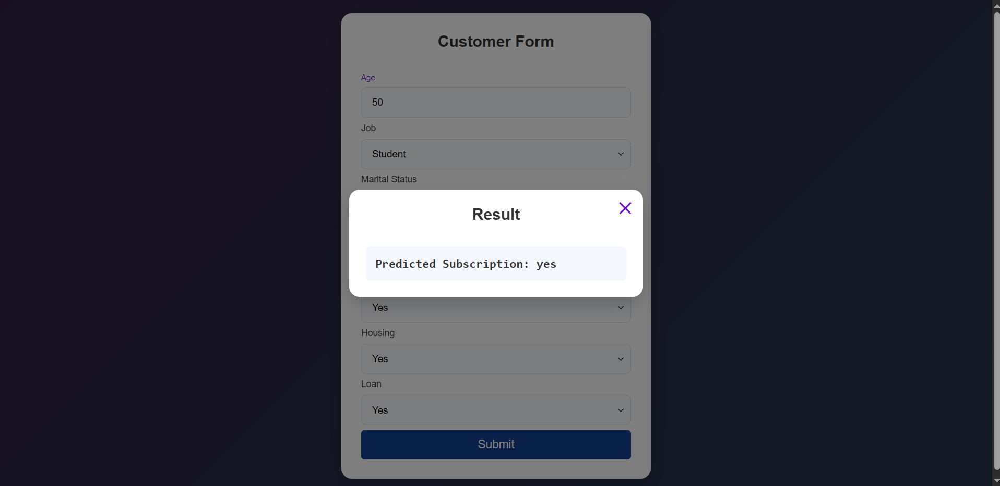

